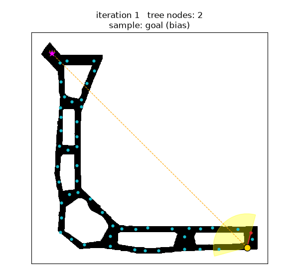
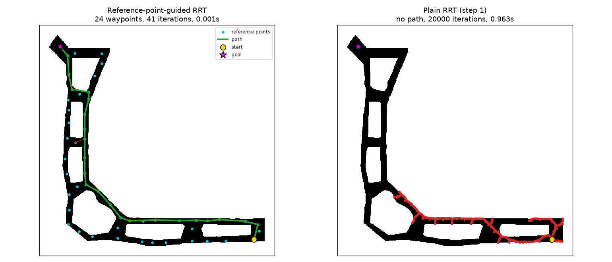
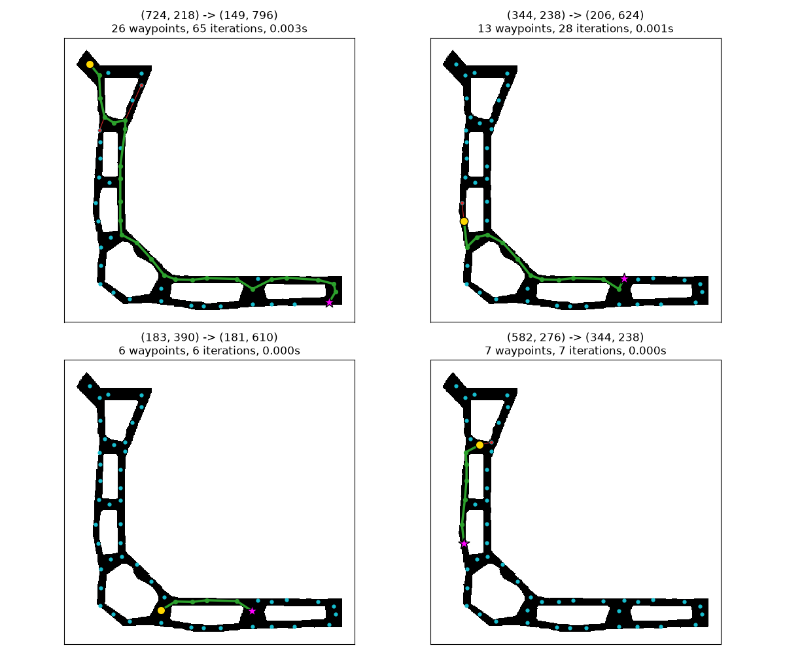

# Reference-Point-Guided RRT

A 2-D motion-planning algorithm that keeps the incremental tree growth of
**RRT (Rapidly-exploring Random Tree)** but lets the tree grow **only through a
small set of pre-selected reference points** on a known map. The result is a
planner that is orders of magnitude faster than pixel-level RRT, does not get
trapped in narrow corridors, and produces short, repeatable paths.

<p align="center"></p>

*Each frame: a sample (orange ×) is drawn — the goal itself half of the time —
the nearest tree node is found, and the tree jumps to the closest
collision-free reference point inside the yellow ±60° sector. The final path
is shown in green.*



*Left: the tree hops between reference points (cyan) and reaches the goal in 41
iterations. Right: plain RRT with step 1 on the same query exhausts 20 000
iterations without leaving the corridor system.*

---

## Motivation — where plain RRT struggles

| Problem with RRT | Why it happens |
|---|---|
| **Slow on large maps** | Every extension is a small step (often 1 px) toward a random sample, so covering a 900×1200 map takes tens of thousands of iterations. |
| **Gets stuck in narrow passages** | Uniform samples rarely fall where they would pull the tree through a corridor; most extensions collide with walls. |
| **Random, suboptimal paths** | Each run builds a different tree; the path zig-zags and needs post-processing. |

The fix is to give the planner prior knowledge (a "clear eye"): a cleaned
binary map, plus a sparse set of **reference points**. These are distinctive
locations chosen so that neighbouring points see each other in a straight line.

## Core idea

Replace "step toward the sample" with "**jump to the best reference point in
the direction of the sample**".

```
Input : occupancy map M, reference set R, start x_s, goal x_g
        epsilon (random-sample prob.), radius r, half-angle θ (= 60°)
Tree T ← {x_s}
repeat
    x_rand ← random cell of M   with prob. epsilon
             x_g                otherwise                 # goal bias
    x_near ← nearest node in T to x_rand
    C      ← RangeWithin(R, x_near, x_rand, r, θ)          # sector filter
    C      ← { c ∈ C : segment(x_near, c) is collision-free }
    if C ≠ ∅:
        x_new ← argmin_{c ∈ C} ‖c − x_near‖
        add x_new to T with parent x_near
until x_new = x_g
return tree path x_s → x_g
```

**RangeWithin (sector filter).** Keep only the reference points that lie
inside a circular sector anchored at `x_near`: radius `r` and opening `±θ`
around the vector `x_near → x_rand`.

```
                 x_rand
                   ▲
          ╲   θ    │    θ   ╱
           ╲       │       ╱      only reference points in this
            ╲      │      ╱       sector (and closer than r) are
             ╲     │     ╱        candidates for the next node
              ╲    │    ╱
               ╲   │   ╱
                 x_near
```

### Why it works

* **Speed.** Every choice (nearest node, candidates, next node) is made
  among ~50 reference points instead of ~1 million pixels. The sector filter
  shrinks the set further before the more expensive collision checks run.
* **Narrow passages.** The reference points were chosen to be mutually
  visible along the corridors, so a collision-free next hop almost always
  exists. The tree can't get stuck the way pixel-level RRT does.
* **Path quality.** The sector keeps growth pointed toward the sample, which
  for half of the iterations is the goal itself, and each hop goes to the
  *closest* valid candidate. Paths come out close to the shortest route
  through the reference graph. In the original experiments they were at most
  one reference point away from optimal.

## Results



Benchmark over 13 start/goal queries × 5 seeds (`python scripts/benchmark.py --runs 5`).
Plain RRT uses step size 1 and a 20 000-iteration budget.

| Planner | Success rate | Mean planning time | Mean path length |
|---|---|---|---|
| **Reference-point-guided RRT** | **100 %** | **~1 ms** | 420 px |
| Plain RRT (step 1) | 74 % | ~505 ms | 434 px (successful runs only) |

On the longest cross-map queries, plain RRT succeeded in only 20–60 % of runs.
The guided planner never failed.

### Python vs. original MATLAB implementation

The same 14 start/goal queries from the original MATLAB experiments
(`python scripts/compare_matlab.py`). Coordinates are MATLAB 1-based (row, col).
Python times are the mean of 20 random seeds.

| # | Start | Goal | MATLAB time (s) | Python time (ms) | Python iterations |
|---|---|---|---|---|---|
| 1 | (150, 797) | (725, 219) | 2.521 | 1.37 | 49 |
| 2 | (536, 245) | (451, 241) | 0.472 | 0.14 | 3 |
| 3 | (451, 245) | (254, 368) | 1.472 | 0.41 | 12 |
| 4 | (195, 244) | (142, 573) | 0.917 | 0.36 | 10 |
| 5 | (232, 388) | (150, 797) | 1.194 | 0.56 | 18 |
| 6 | (568, 305) | (697, 242) | 2.992 | 0.62 | 22 |
| 7 | (184, 391) | (182, 611) | 0.809 | 0.28 | 8 |
| 8 | (393, 293) | (583, 277) | 1.002 | 0.34 | 8 |
| 9 | (725, 219) | (150, 797) | 3.050 | 1.52 | 60 |
| 10 | (345, 239) | (207, 625) | 1.347 | 0.83 | 23 |
| 11 | (345, 239) | (207, 625) | 13.726 | 0.81 | 23 |
| 12 | (451, 241) | (184, 391) | 0.996 | 0.63 | 19 |
| 13 | (583, 277) | (345, 239) | 0.784 | 0.75 | 20 |
| 14 | (205, 658) | (145, 657) | 6.948 | 3.05 | 102 |
| | **Mean** | | **2.731** | **0.83** | **27** |

This is not an apples-to-apples speed test. The MATLAB `tic/toc` wrapped the
whole loop, which **redrew the tree and called `pause(0.01)` on every
iteration**, so most of its time is plotting. The Python times cover the
algorithm alone, with vectorised NumPy collision checks. At ~10 ms of pause per
iteration, the ~27 iterations a query needs already account for ~0.3 s of the
MATLAB time before any drawing. Rows 10 and 11 are the same query run twice in MATLAB; the 10× gap
between them shows how much a single random run can vary.

## Repository layout

```
refrrt/
  planner.py        # the reference-point-guided RRT (core algorithm)
  collision.py      # segment-vs-occupancy-grid collision check
  baseline_rrt.py   # plain goal-biased RRT for comparison
  io.py             # load map + reference points
  viz.py            # plotting helpers
scripts/
  run_demo.py       # plan one query, print waypoints, plot
  compare.py        # side-by-side vs. plain RRT
  gallery.py        # grid of example paths
  benchmark.py      # success / time / length over many queries
  compare_matlab.py # timing table vs. the original MATLAB runs
  animate.py        # GIF of the tree growing (docs/images/demo.gif)
data/
  map.npz                  # 900×1200 binary occupancy grid (True = obstacle)
  reference_points.csv     # 53 reference points, (row, col)
```

## Usage

```bash
pip install -r requirements.txt

python scripts/run_demo.py                                   # default query
python scripts/run_demo.py --start 344 238 --goal 206 624 --seed 1
python scripts/compare.py
python scripts/benchmark.py --runs 10
python scripts/animate.py --out docs/images/demo.gif         # needs Pillow (installed with matplotlib)
```

```python
from refrrt import load_map, load_reference_points, plan

result = plan(load_map(), load_reference_points(), start=(149, 796), goal=(724, 218))
print(result.success, result.path)
```

Coordinates are `(row, col)` pixel indices into the map. Parameters:
`epsilon` (random-sample probability, default 0.5), `radius` (sector radius,
default 100 px), `half_angle` (default π/3).

## Limitations and future work

* Reference points must be selected in advance for a static environment, so
  the method does not adapt to dynamic scenes. Automating reference-point
  selection, for example from a visibility graph or skeletonisation of the
  free space, is the natural next step.
* The goal must be reachable through the reference set. The planner adds the
  goal to the set automatically, but a start or goal with no visible
  reference point nearby cannot be connected.
* Parameters (`radius`, `half_angle`, `epsilon`) are hand-tuned for this map.
